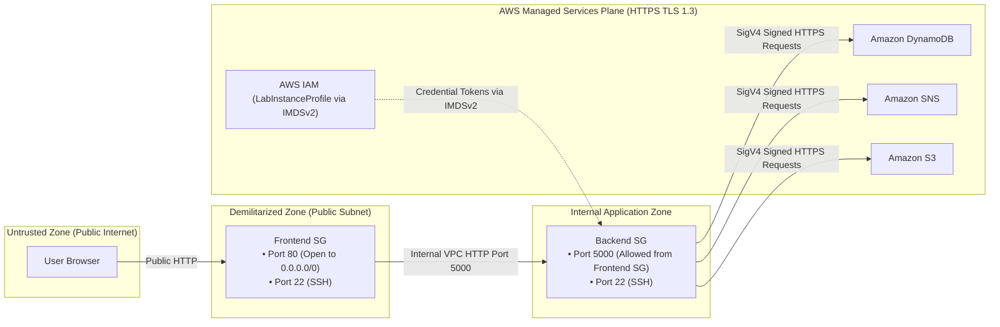
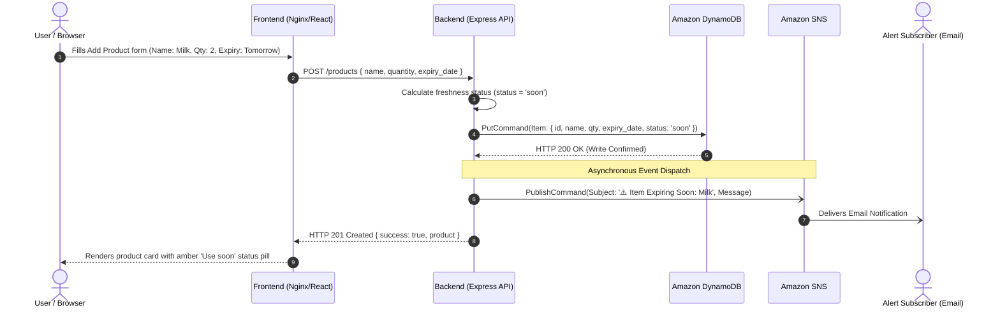
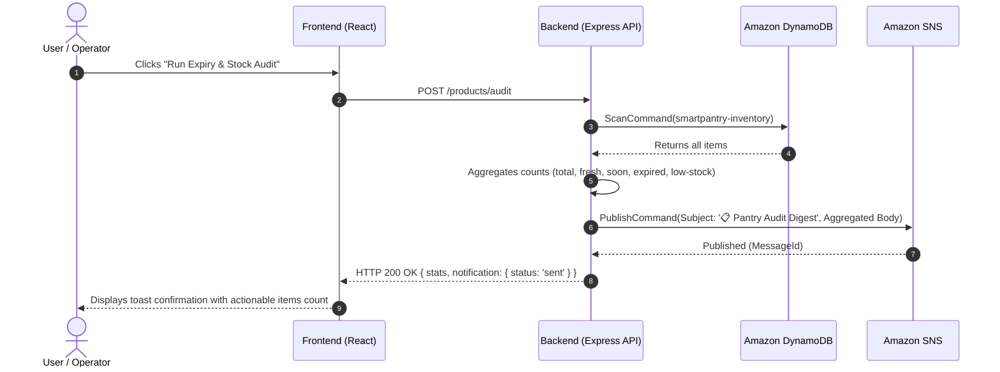

# 🏗️ SmartPantry Cloud Architecture Documentation
**COSC349 Assignment 2: Redesigning and Deploying Software for the Cloud**

This document provides a comprehensive technical reference for the cloud architecture of **SmartPantry**, explaining the system components, data flows, trust boundaries, and purposeful integration of AWS managed cloud services.

---

## 1. Architectural Overview

SmartPantry is structured as a cloud-native, multi-tier distributed system hosted on Amazon Web Services (AWS). It builds upon Assignment 1's local virtual machine design by adopting cloud-managed services that provide high availability, serverless scaling, robust security, and decoupled event handling.

```mermaid
flowchart TD
    subgraph Client ["Client Layer"]
        Browser["User Web Browser"]
    end

    subgraph AWSCloud ["AWS Cloud (us-east-1 / AWS Academy Learner Lab)"]
        subgraph VPC ["Default VPC (172.31.0.0/16)"]
            subgraph PublicSubnet ["Public Subnet (172.31.16.0/20)"]
                
                subgraph SGFE ["Security Group: smartpantry-frontend-sg"]
                    FE_EC2["Frontend EC2 (t3.micro)\n• Nginx Web Server (Port 80)\n• React + Vite Static Bundle\n• Reverse Proxy (/api/)"]
                end

                subgraph SGBE ["Security Group: smartpantry-backend-sg"]
                    BE_EC2["Backend EC2 (t3.micro)\n• Node.js 22 LTS + Express (Port 5000)\n• AWS SDK v3 Integration\n• IAM LabInstanceProfile (IMDSv2)"]
                end

            end
        end

        subgraph ManagedStorageLayer ["Managed Storage Service (Primary Database)"]
            DDB[("Amazon DynamoDB\n• Table: smartpantry-inventory\n• Serverless On-Demand Mode\n• Hash Key: id (UUID)")]
        end

        subgraph MessagingLayer ["Further Managed Cloud Service (Decoupled Messaging)"]
            SNS["Amazon SNS Topic\n• Topic: smartpantry-alerts\n• Email & Protocol Subscriptions\n• Real-Time Expiry & Stock Dispatches"]
        end

        subgraph ObjectStorageLayer ["Managed Object Storage (Reports & Backups)"]
            S3[("Amazon S3 Bucket\n• smartpantry-data-*\n• Encrypted SSE-S3\n• Inventory Snapshots")]
        end

        subgraph TelemetryLayer ["Operational Monitoring"]
            CW["Amazon CloudWatch\n• EC2 Metric Alarms (CPU > 80%)\n• Alarms to SNS Alerts Topic"]
        end
    end

    Browser -->|HTTP Port 80| FE_EC2
    Browser -.->|Direct API Testing Port 5000| BE_EC2
    FE_EC2 -->|Internal API Proxy Port 5000| BE_EC2
    BE_EC2 -->|PutItem / GetItem / Scan / DeleteItem| DDB
    BE_EC2 -->|Publish Expiry & Low Stock Alerts| SNS
    BE_EC2 -->|PutObject (JSON Snapshots)| S3
    CW -.->|Alarm State Trigger| SNS
    SNS -->|Email Notification| Browser
```

---

## 2. Component Breakdown

### 2.1. Presentation Tier (`smartpantry-frontend` EC2)
- **Host & Compute**: AWS EC2 `t3.micro` virtual machine running Ubuntu 24.04 LTS.
- **Web Server**: High-performance Nginx web server listening on port 80.
- **Frontend Stack**: Single-Page Application (SPA) built with React 19 and Vite.
- **Nginx Configuration**:
  - Serves static optimized production bundle with client-side routing fallback (`try_files $uri $uri/ /index.html`).
  - Implements an HTTP reverse proxy routing requests matching `/api/*` to the Backend EC2 instance on port 5000 (`http://<backend-private-ip>:5000/`). This eliminates browser CORS complications and hides internal backend IP addresses from external exposure.

### 2.2. Application Tier (`smartpantry-backend` EC2)
- **Host & Compute**: AWS EC2 `t3.micro` virtual machine running Ubuntu 24.04 LTS.
- **Application Runtime**: Node.js 22 LTS with Express REST API.
- **Process Management**: Managed as a persistent `systemd` unit (`smartpantry-backend.service`), ensuring automatic restart on crashes and zero-downtime reboots.
- **Cloud Identity & Authentication**: Attaches the AWS Academy `LabInstanceProfile`. The AWS SDK v3 automatically resolves temporary credentials from the EC2 Instance Metadata Service v2 (IMDSv2). No access keys, secret tokens, or passwords are hardcoded or stored on disk.
- **Adaptive Fallback**: If AWS services are unreachable or during local test execution, the backend gracefully switches to an in-memory storage adapter without crashing.

### 2.3. Managed Storage Tier (Amazon DynamoDB)
- **Service**: Amazon DynamoDB (AWS Fully Managed NoSQL Database).
- **Table Name**: `smartpantry-inventory`.
- **Primary Key**: `id` (Partition Key, String UUID).
- **Billing Mode**: `PAY_PER_REQUEST` (On-Demand capacity). This guarantees **\$0.00 idle cost** while scaling to thousands of reads and writes per second with single-digit millisecond latency.
- **Data Model**:
  ```json
  {
    "id": "item-1790055769683-7f48212b",
    "name": "Whole Milk",
    "quantity": 2,
    "expiry_date": "2026-09-23",
    "category": "Dairy",
    "status": "soon",
    "created_at": "2026-09-22T05:42:49.684Z"
  }
  ```

### 2.4. Further Non-EC2 Managed Service (Amazon SNS)
- **Service**: Amazon Simple Notification Service (Amazon SNS).
- **Topic Name**: `smartpantry-alerts`.
- **Role in Workflow**: Decouples application business events from communication channels. When products are logged that are near expiry (`status == 'soon'`), expired (`status == 'expired'`), or low in quantity (`quantity <= 2`), the backend publishes an alert message to this topic.
- **Subscriptions**: Supports multi-channel fan-out (Email, SMS, HTTPS webhooks, SQS queues). Users can subscribe their personal email directly through the web UI.

### 2.5. Managed Object Storage (Amazon S3)
- **Service**: Amazon Simple Storage Service (Amazon S3).
- **Bucket**: `smartpantry-data-<random-id>`.
- **Role**: Durable, cost-effective storage for immutable inventory snapshots and audit records.
- **Security**: Public access blocked completely; server-side encryption (SSE-S3) enabled by default.

### 2.6. Operational Telemetry (Amazon CloudWatch)
- **Service**: Amazon CloudWatch Alarms.
- **Alarm**: `smartpantry-backend-high-cpu`.
- **Trigger**: EC2 average CPU utilization $\ge 80\%$ over two consecutive 2-minute periods.
- **Action**: Triggers an alert notification to the `smartpantry-alerts` SNS topic.

---

## 3. Trust Boundaries & Security Architecture



### Security Controls:
1. **Network Boundary**:
   - `smartpantry-frontend-sg`: Exposes only HTTP port 80 to the public internet.
   - `smartpantry-backend-sg`: In production, accepts API requests originating from `smartpantry-frontend-sg`. Egress is open to reach AWS API endpoints.
2. **Identity & Access Boundary**:
   - Zero hardcoded AWS credentials in source code, environment files, or git.
   - The Backend EC2 instance uses AWS Identity and Access Management (IAM) through `LabInstanceProfile`.
   - All SDK requests are signed using **AWS Signature Version 4 (SigV4)** via IMDSv2 tokens.
3. **Storage Boundary**:
   - The S3 bucket enforces `block_public_acls = true` and `block_public_policy = true`. Data cannot be leaked to unauthorized public accessors.

---

## 4. End-to-End Workflow Sequences

### Sequence 1: Adding a Product & Automated SNS Alert Dispatch


### Sequence 2: Expiry & Stock Audit Sweep

